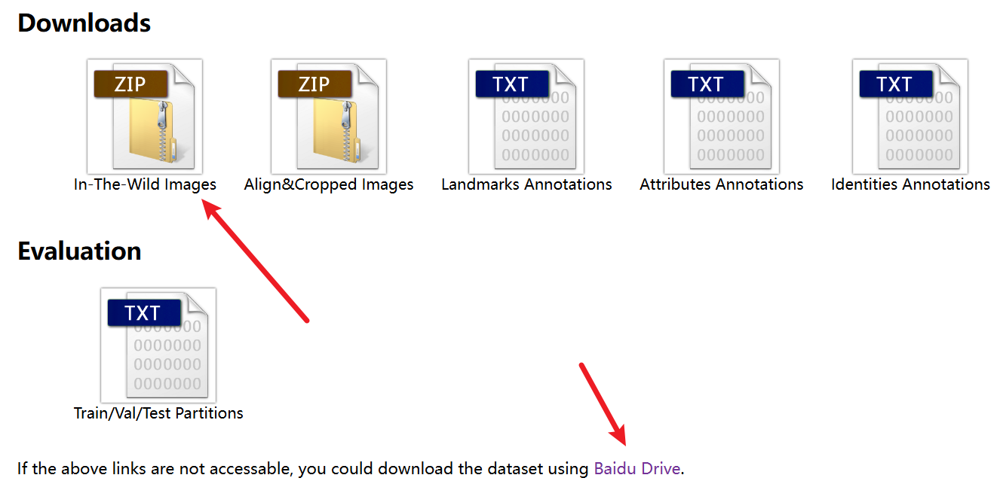
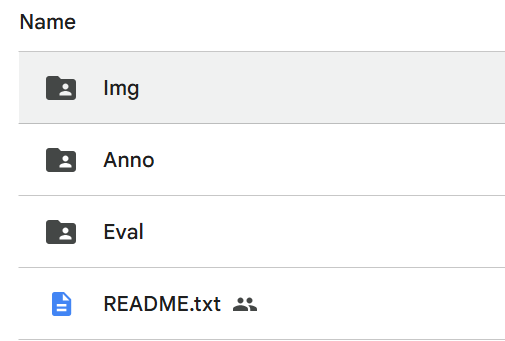
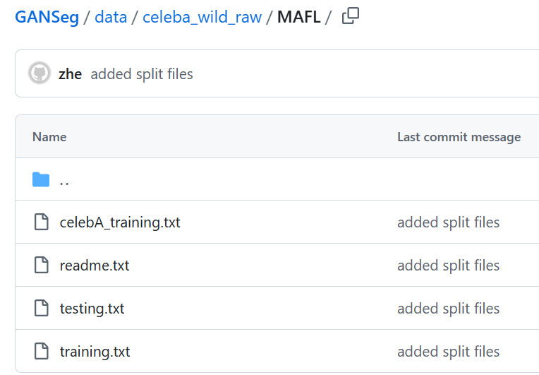
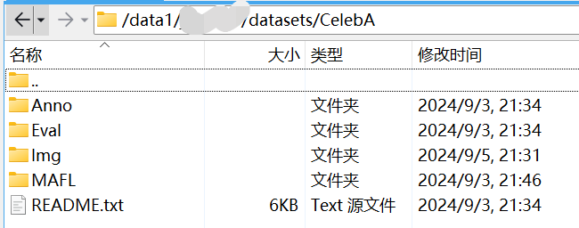

# CelebA Dataset

1. open the link:

https://mmlab.ie.cuhk.edu.hk/projects/CelebA.html

click the link here:

2. unzip the file

3. download the MAFL from previous research:

https://github.com/xingzhehe/GANSeg/tree/main/data/celeba_wild_raw/MAFL

The directory will be like this:

4. all preparations are done.